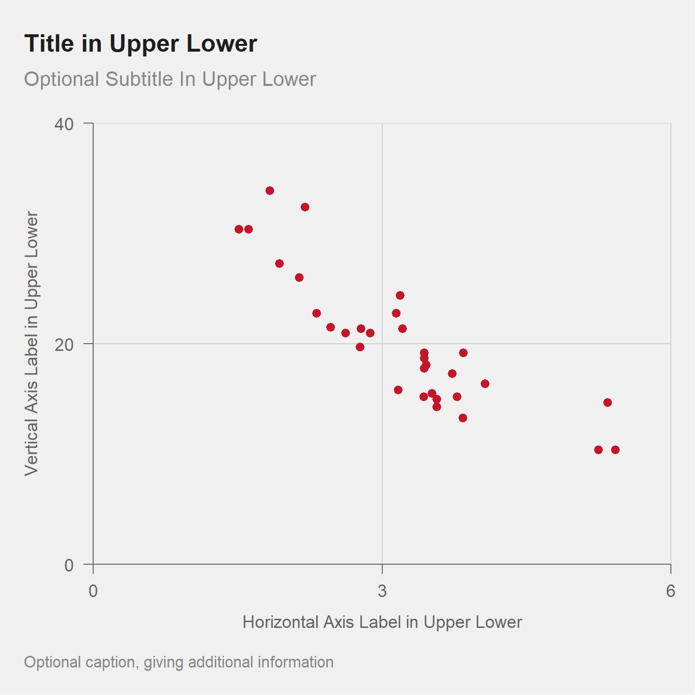
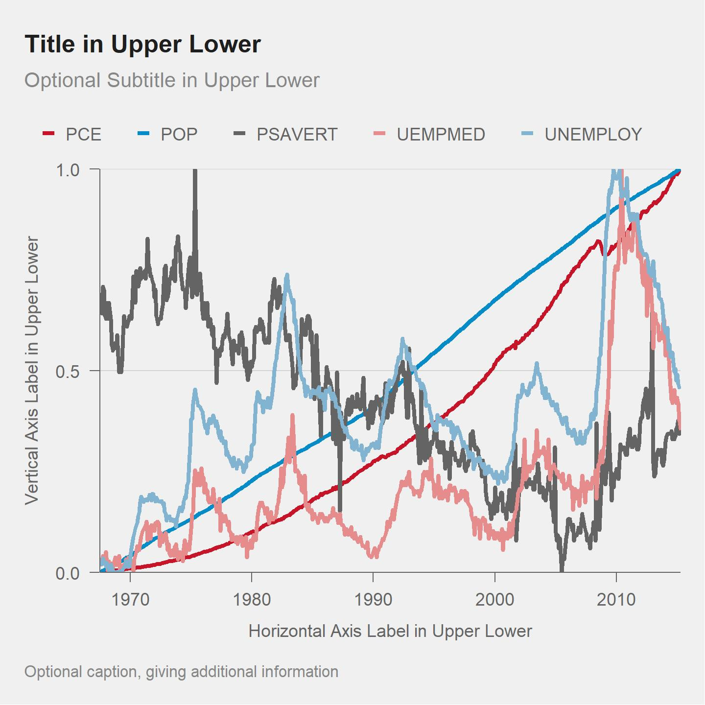
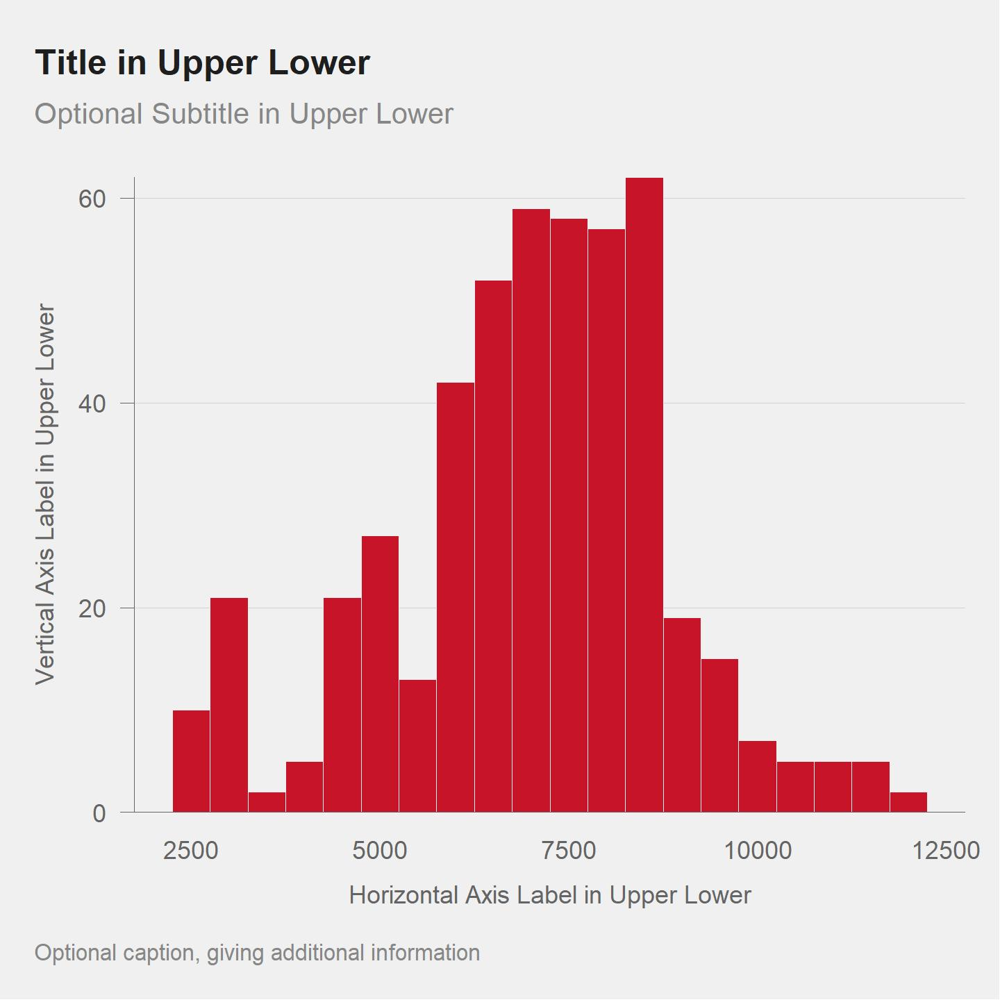
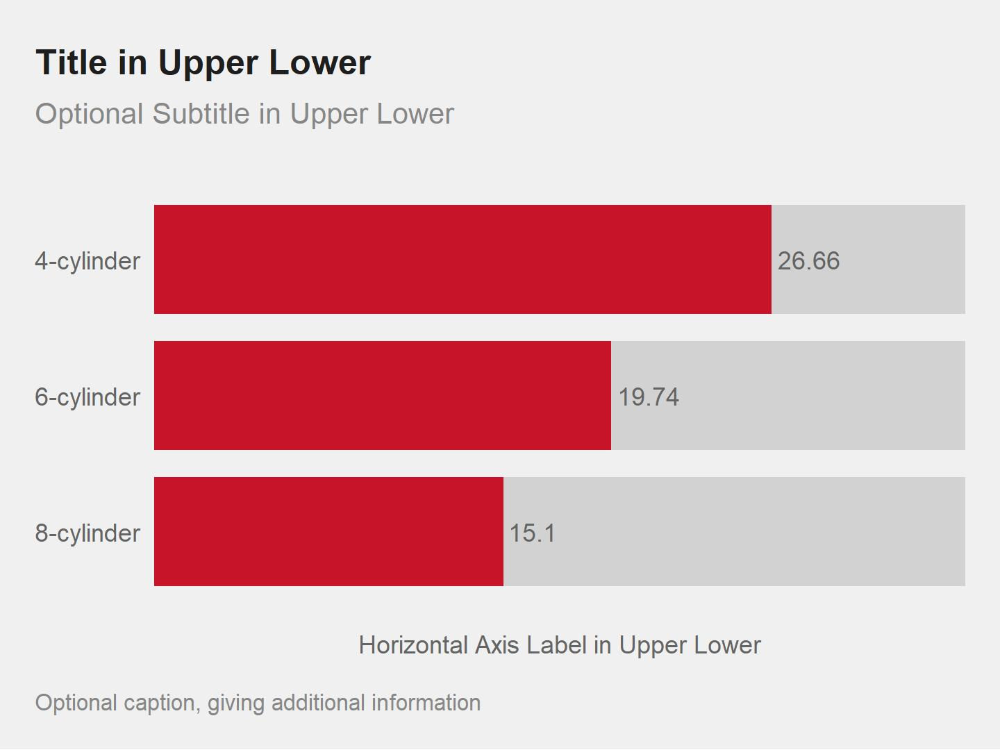
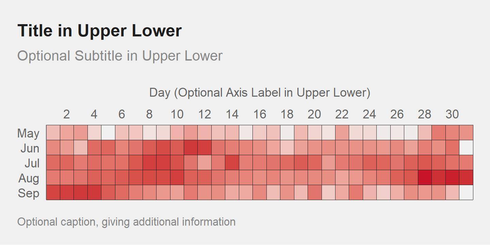
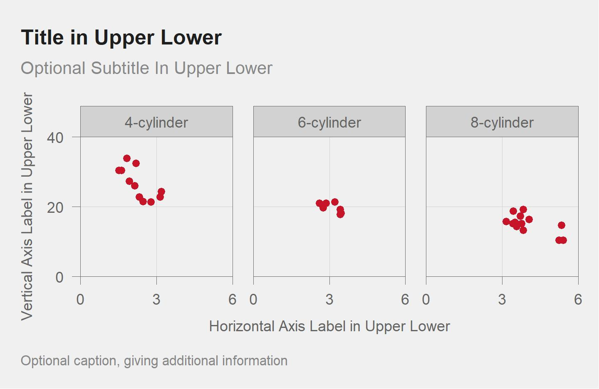

<!-- README.md is generated from README.Rmd. Please edit that file -->

```{r, include = FALSE}
knitr::opts_chunk$set(
  collapse = TRUE,
  comment = "#>",
  fig.path = "man/figures/README-",
  out.width = "100%"
)
library(knitr)
```
# themesn

<!-- badges: start -->
<!-- badges: end -->

The package `themesn` contains a `ggplot` theme `theme_sn` for creating data journalism-style data visualizations with color palettes and formatting similar to those used by BBC, NY Times, and ESPN.

## Installation

You can install the GitHub version of `themesn` with:

``` r
devtools::install_github("bmacGTPM/themesn")
```

If you get an error about download method, try changing this option before installing. 

```r
options(download.file.method = 'libcurl')
```

## Example Figures 
See the help file `?theme_sn` for code that generates these figures.


## Scatter plot example
```{r  out.width = "60%", echo=F}
 
```

## Line plot example
```{r  out.width = "60%", echo=F}
 
```

## Histogram example
```{r  out.width = "60%", echo=F}
 
```

## Bar plot example
```{r  out.width = "60%", echo=F}
 
```

## Grid plot example
```{r  out.width = "60%", echo=F}
 
```

## Faceting example
```{r  out.width = "60%", echo=F}
 
```
